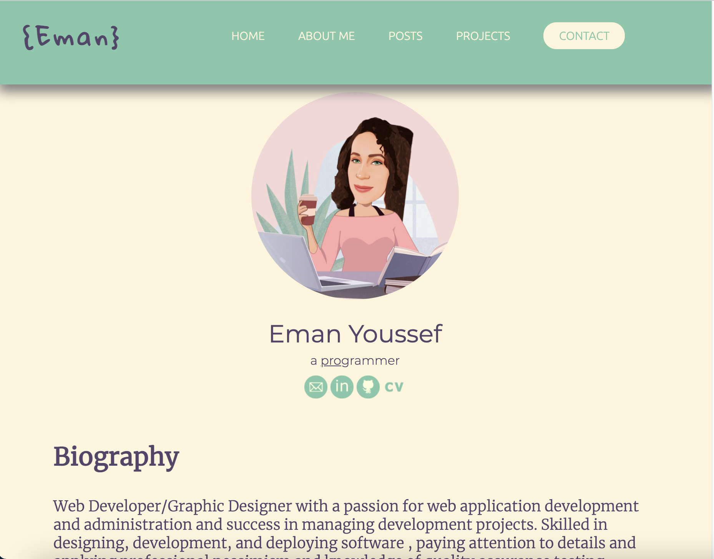

# Project T1A2 :Portfolio Website

  
  <h3 align="center">Portfolio Website</h3>

  

    A breif presentation of me as a dev and IT professional. 
     
    

 

## Table of contents
- [About the Website](#about-the-website)
- [Technical](#technical)
- [To Do List](#to-do-list)
- [Contact Information](#contact-information)

### About the website

This portfolio website provides information about my skills and intests and professional knowledge, and showcase of my work and to give site visitors an idea bout what I can do as a web developer
The website reflects my ability to  design, deveop and deploy a website using HTML, CSS and some JS code.
The website consists of 

#### Target Audience:

#### Host:
The project is hosted in netlify 
##### https://eman-youssef.netlify.app/
and GitHub
##### https://github.com/EEYoussef/Portfolio.git

### Technical

#### Technology Used
This project uses:
    - HTML
    - CSS
    - Js
    -Netlify.app
    -ormspree.io
#### Sitemap

#### Wireframes

####Screenshots

#### How to run the project

You can:
    a.Click on the link provided OR
    b.Clone the project from GitHub 

### To Do List

List of features I am working on.

- [ ] Adding animations to the home page.
- [ ] Creating a slide show gallery.
- [ ] Adding Sidebar.
- [ ] Enhance the responsiveness of the project.
- [ ] Add real time blog posts.
- [ ] Uploading more projects.
- [x] Creating Gif Logo image.

#### CONTRIBUTING

I would love to have your help in making  my portfolio better. The project is still not very complete, but if there's an suggestions please let me know.

